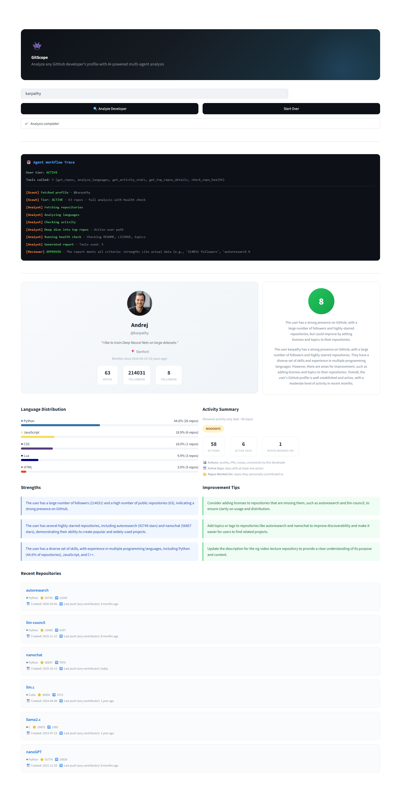
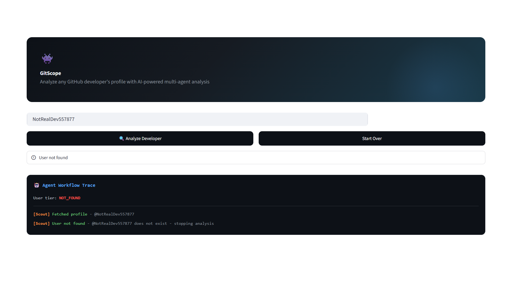
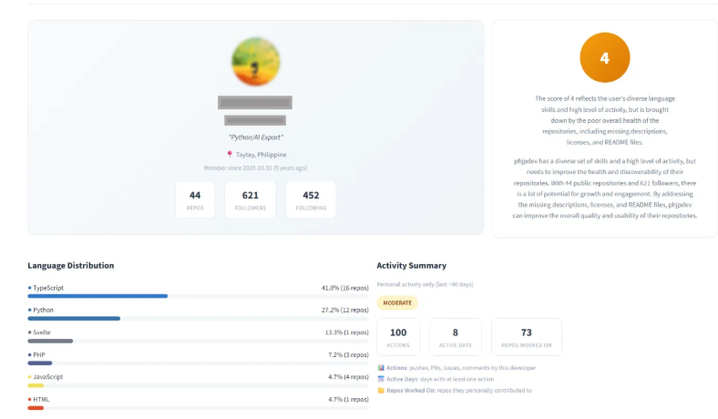
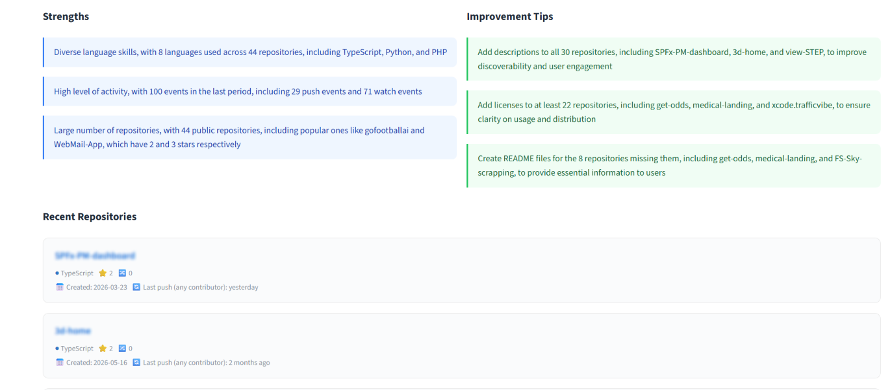

# GitScope 👾 GitHub Developer Profile Analyzer

A **multi-agent** LangGraph system that analyzes GitHub developers using real API data. Each agent makes genuine decisions: the Scout routes based on profile size, the Analyst adapts tools per user tier, and the Reviewer validates report quality before displaying.

> Built with LangGraph, Groq (Llama 3.3 70B), and Streamlit.

---

## Demo Results

All results below are from actual runs with real GitHub API data (August 2026).

### Andrej Karpathy (@karpathy) - Score: 8/10

Full analysis with 5 tools, health check, and reviewer approval.

<p align="center">
  
</p>

- **Tier: ACTIVE** (63 repos) → full analysis path with health check
- **5 tools called**: repos, languages, activity, top repos, health check
- **Reviewer: APPROVED** - strengths cite actual data (92,749 stars on autoresearch)
- **Specific tips**: "Add licenses to autoresearch and llm-council", "Update ng-video-lecture description"

### User Not Found - Stops Immediately

Scout detects the user doesn't exist and stops without wasting API calls.

<p align="center">
  
</p>

- **Tier: NOT_FOUND** → analysis stops after 1 API call
- No tools called, no LLM invoked - saves time and API quota
- This is a real routing decision, not a fixed sequence

### Active Developer (44 repos) - Score: 4/10

Health check reveals missing descriptions, licenses, and READMEs.

<p align="center">
  
</p>

<p align="center">
  
</p>

- **Tier: ACTIVE** → full analysis with health check
- **Score: 4/10** - high activity but poor repository health
- **Specific tips**: "Add descriptions to SPFx-PM-dashboard, 3d-home", "Create README files for get-odds, medical-landing"
- Shows that the health check tool provides actionable insights GitHub itself doesn't surface

---

## Architecture - Why LangGraph Matters

```
START → Supervisor → Scout Agent → get_user_profile
                        │
                 ┌──────┼──────────┐
                 │      │          │
            NOT FOUND  NEW USER   ACTIVE USER
                 │      │          │
                END   3 tools     5 tools + health check
                        │          │
                        └────┬─────┘
                             │
                      Analyst Agent (writes report)
                             │
                      Reviewer Agent
                        │         │
                     REVISE      PASS
                        │         │
                  ← Analyst       │
                                  ↓
                               FINISH
```

### What Each Agent Does and Why It's an Agent

| Agent | What It Does | Why It Can't Be a Simple Function |
|---|---|---|
| **Scout** | Fetches profile, decides tier (not_found / new / active) | Routes the entire pipeline - different tiers get different tools |
| **Analyst** | Calls 3 or 5 tools based on tier, writes JSON report | Adapts tool selection and reuses cached data on revision |
| **Reviewer** | LLM evaluates report quality, can reject with feedback | Uses LLM judgment to check specificity - can't be done with if/else |

### The Reviewer Is Where LangGraph Adds Real Value

The Reviewer uses an LLM to check:
1. **Specificity**: "autoresearch has 92,749 stars" vs generic "popular repos"
2. **Actionable tips**: "Add LICENSE to llm-council" vs "improve documentation"
3. **Score accuracy**: does the score match the actual data?
4. **JSON structure**: required keys present?

If the report fails, it goes back to the Analyst with specific feedback - a genuine feedback loop that improves output quality.

---

## Features

| Feature | Description |
|---|---|
| **Adaptive routing** | Scout decides the path - not-found stops, new users get lighter analysis |
| **6 GitHub tools** | Profile, repos, languages, activity, top repos, health check |
| **Health check** | Checks README, LICENSE, description, topics - names specific repos |
| **Report review** | Reviewer validates quality before displaying |
| **Agent trace** | Terminal-style panel showing every agent decision in real time |
| **Clear metrics** | Activity shows personal actions only with explanations |
| **Dual dates** | Repos show Created date + Last push (any contributor) |

---

## Quick Start

### Prerequisites
- Python 3.10+
- Free [Groq API key](https://console.groq.com)
- Optional: [GitHub token](https://github.com/settings/tokens) for 5,000 req/hour (vs 60 without)

### Installation

```bash
git clone https://github.com/SuraSammour12/gitscope.git
cd gitscope

pip install -r requirements.txt

cp .env.example .env
# Edit .env: add your GROQ_API_KEY and optionally GITHUB_TOKEN
```

### Run

```bash
streamlit run app.py
```

---

## Project Structure

```
gitscope/
├── app.py              # Streamlit UI with agent trace panel
├── agent.py            # Multi-agent LangGraph: Scout + Analyst + Reviewer
├── tools.py            # 6 tools calling real GitHub API
├── test_tools.py       # 30 tests: tools, routing, scout decisions, graph
├── requirements.txt
├── .env.example
├── screenshots/
│   ├── karpathy-full.png
│   ├── not-found.png
│   ├── active-dev-profile.png
│   └── active-dev-tips.png
└── README.md
```

---

## Tests

```bash
python -m pytest test_tools.py -v -p no:anyio
```

30 tests covering:
- GitHub tools with mocked API responses
- Supervisor routing (6 different paths)
- Scout tier decisions (not_found, new, active)
- Graph structure and node verification
- State field validation

---

## Tech Stack

| Layer | Technology |
|---|---|
| **Orchestration** | LangGraph (Supervisor + Scout/Analyst/Reviewer) |
| **LLM** | Groq - Llama 3.3 70B (auto-fallback to 8B) |
| **Data** | GitHub API (real-time, 5,000 req/hour with token) |
| **Frontend** | Streamlit with custom CSS |
| **Testing** | pytest with mocked API calls |

---

## Known Limitations

- GitHub API: 60 requests/hour without token, 5,000 with token
- Health check calls README endpoint per repo (uses extra API quota)
- Activity data shows only public events (private repos not visible)
- `pushed_at` reflects pushes from any contributor, not just the repo owner
- Reviewer adds 1 extra LLM call for quality validation