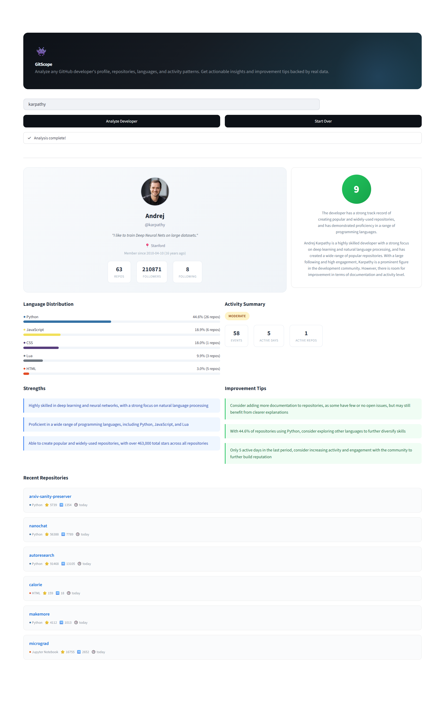
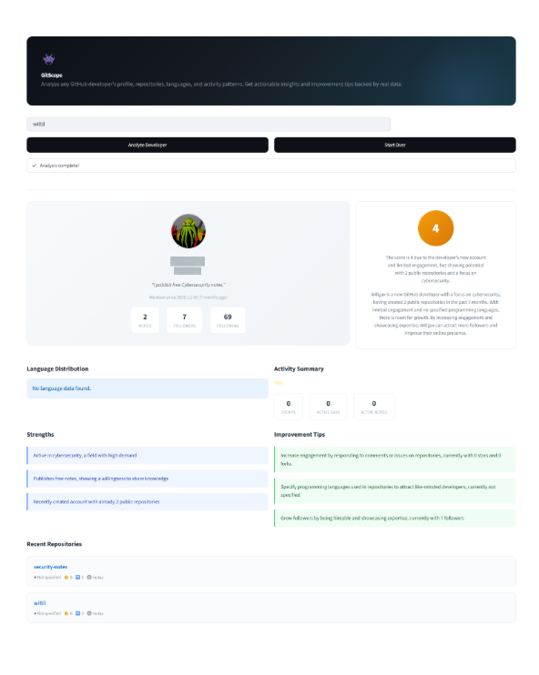

# GitScope 👾 GitHub Developer Profile Analyzer

A LangGraph-powered agent that analyzes any GitHub developer's profile using **real API data** and delivers structured insights with actionable improvement tips through an elegant Streamlit interface.

GitScope takes a GitHub username, autonomously calls 5 specialized tools via the GitHub API, then uses an LLM to generate a comprehensive developer report including a score, strengths, and specific improvement recommendations.

## How It Works

1. User enters a GitHub username
2. The LangGraph agent calls `get_user_profile` first
3. Then autonomously calls `get_repos`, `analyze_languages`, `get_activity_stats`, and `get_top_repos_details`
4. After collecting all data, the LLM generates a JSON analysis with score, strengths, and tips
5. Streamlit renders the results in an elegant dashboard

## Live Demo Results

All results below are from actual runs of GitScope with real GitHub API data (July 2026).

### Andrej Karpathy (@karpathy) - Score: 9/10



- **Score: 9/10** with 210,871 followers and 63 public repositories
- **Languages:** Python (44.6%), JavaScript (18.9%), CSS (18.0%), Lua (9.9%)
- **Activity:** MODERATE with 58 events across 5 active days
- **Top Repos:** nanochat (56,388 stars), autoresearch (81,468 stars), micrograd (16,755 stars)
- **AI-generated Tips:** "Consider adding more documentation", "Only 5 active days, consider increasing activity"

### Francois Chollet (@fchollet) - Score: 8/10


- **Score: 8/10** with 18,116 followers, creator of Keras
- **Languages:** Python (87.4%), HTML (8.9%)
- **Top Repos:** ARC-AGI (4,803 stars), deep-learning-with-python-notebooks (20,187 stars)
- **AI-generated Strengths:** "Highly experienced in deep learning and AI, with popular repositories"
- **AI-generated Tips:** "Increase original repositories, as 8 out of 16 are forked", "Improve language diversity"

### New Developer Profile - Score: 4/10



GitScope provides honest, data-backed feedback for developers at all levels:

- **Score: 4/10** for a 7-month-old account with 2 repositories and 7 followers
- **AI-generated Strengths:** "Active in cybersecurity, a field with high demand", "Publishes free notes, showing willingness to share knowledge"
- **AI-generated Tips:** "Increase engagement by responding to comments or issues", "Specify programming languages in repositories", "Grow followers by being hireable and showcasing expertise"

## Architecture

```
User enters username
        |
        v
+---------------+     +------------------+
| agent_node    |---->| should_continue? |
| (LLM decides) |     | tool_calls?      |
+---------------+     +--------+---------+
        ^                 |           |
        |                YES          NO
        |                 |           |
  +-----+------+    +----v----+   +--v--+
  | Back to    |<---| ToolNode |  | END |
  | agent with |    | runs it  |  +-----+
  | results    |    +----------+
  +------------+
```

**Pattern:** ReAct (Reason, Act, Observe, Repeat)

**Framework:** LangGraph with conditional routing

**LLM:** Groq (Llama 3.3 70B), free and fast

**Data:** Live from GitHub API, no mocks

## Tools

The agent uses 5 tools that call the GitHub API in real time:

| Tool | What it does | API Endpoint |
|------|-------------|-------------|
| `get_user_profile` | Profile info, followers, repos count | `/users/{username}` |
| `get_repos` | List repos with stars, forks, language | `/users/{username}/repos` |
| `analyze_languages` | Language distribution across all repos | `/users/{username}/repos` |
| `get_activity_stats` | Recent events, active days, commit count | `/users/{username}/events` |
| `get_top_repos_details` | Deep dive into top repos by stars | `/users/{username}/repos?sort=stars` |

The agent calls all 5 tools autonomously in sequence, then the LLM generates a JSON report with score, strengths, and tips.

## Streamlit UI Features

- Profile card with avatar, bio, location, and follower stats
- Score circle (color-coded: green 7+, yellow 4-6, red 1-3)
- Language distribution with colored progress bars
- Activity summary with event/day/repo counts
- Strengths panel (blue cards)
- Improvement tips panel (green cards)
- Recent repositories list with stars, forks, and language

## Setup

```bash
git clone https://github.com/SuraSammour12/gitscope.git
cd gitscope

pip install -r requirements.txt

cp .env.example .env
# Add your GROQ_API_KEY to .env (free at console.groq.com)

streamlit run app.py
```

Or run the agent directly in terminal:

```bash
python agent.py karpathy
```

## Project Structure

```
gitscope/
├── app.py              # Streamlit UI with custom CSS
├── agent.py            # LangGraph ReAct agent
├── tools.py            # 5 tools calling GitHub API
├── test_tools.py       # Unit tests (mocked) + live API tests
├── requirements.txt
├── .env.example
├── .gitignore
├── screenshots/
│   ├── karpathy.png
│   ├── chollet.png
│   └── new-developer.png
└── README.md
```

## Tests

```bash
# All tests (mocked + live)
python -m pytest test_tools.py -v

# Only mocked tests (no network needed)
python -m pytest test_tools.py -v -k "not Live"
```

## Tech Stack

- **LangGraph** - Agent orchestration with ReAct pattern
- **LangChain** - LLM integration and tool framework
- **Groq + Llama 3.3 70B** - Free, fast LLM inference
- **GitHub API** - Real-time developer data (free, 60 requests/hour)
- **Streamlit** - Interactive web UI
- **pytest** - Testing with mocked and live API tests

## Known Limitations

- GitHub API rate limit: 60 requests/hour without authentication (add a GitHub token for 5,000/hour)
- Activity data shows only public events (private repo activity is not visible via the API)
- `updated_at` reflects any repo change (stars, issues), not just code commits
- Language percentages are based on repository size, not lines of code

